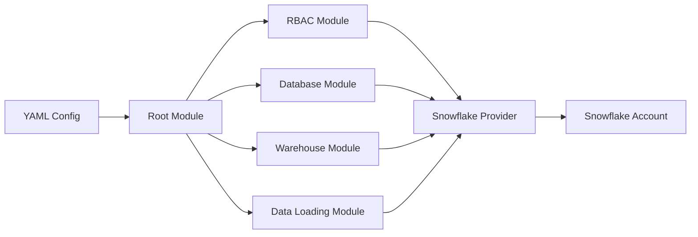

# Architecture Documentation

## 1. Overview

This document describes the architecture of the Terraform Snowflake Account Objects module, with a focus on the 3-layer data architecture pattern and modular design principles.

## 2. 3-Layer Data Architecture

### 2.1 Architecture Diagram

```
┌─────────────────────────────────────────────────────────────────────────┐
│                          SNOWFLAKE ACCOUNT                              │
├─────────────────────────────────────────────────────────────────────────┤
│                                                                         │
│  ┌─────────────┐     ┌─────────────┐     ┌─────────────┐             │
│  │   RAW       │     │  PREPARE    │     │  ANALYSIS    │             │
│  │   Layer     │ ──► │   Layer     │ ──► │   Layer     │             │
│  └─────────────┘     └─────────────┘     └─────────────┘             │
│                                                                         │
│  ┌─────────────────────────────────────────────────────┐              │
│  │                    WAREHOUSES                        │              │
│  ├──────────────┬──────────────┬────────────────────────┤              │
│  │ INGEST_WH    │ TRANSFORM_WH │ ANALYTICS_WH          │              │
│  │ (X-Small)    │ (Small-Med)  │ (Medium-Large)        │              │
│  └──────────────┴──────────────┴────────────────────────┘              │
│                                                                         │
│  ┌─────────────────────────────────────────────────────┐              │
│  │                      ROLES (Simplified)              │              │
│  ├──────────────┬──────────────┬────────────────────────┤              │
│  │ READER_RL    │ WRITER_RL    │ ADMIN_RL              │              │
│  │ (Read data)  │ (Read/Write) │ (Full access)         │              │
│  └──────────────┴──────────────┴────────────────────────┘              │
└─────────────────────────────────────────────────────────────────────────┘
```

### 2.2 Layer Definitions

#### 2.2.1 RAW Layer
**Purpose**: Landing zone for source data in its original format

**Characteristics**:
- No transformations applied
- Data stored as-is from source systems
- Minimal data quality checks
- Focus on data capture and storage

**Schema Structure**:
```sql
RAW/
├── FIVETRAN/          # Fivetran managed schemas
├── KAFKA/             # Streaming data landing
├── SALESFORCE/        # CRM data landing
├── FILES/             # File-based data landing
└── APIS/              # API data landing
```

**Access Patterns**:
- Write: Data loaders (Fivetran, Snowpipe, custom ETL)
- Read: Transformation processes only

#### 2.2.2 PREPARE Layer
**Purpose**: Data preparation, cleansing, normalization, and integration

**Characteristics**:
- Data type standardization
- Business key mapping
- Data quality improvements
- Cross-source integration
- Slowly Changing Dimensions (SCD) implementation

**Schema Structure**:
```sql
PREPARE/
├── STANDARDIZED/      # Type-converted and standardized
├── CLEANSED/          # Data quality applied
├── INTEGRATED/        # Cross-source joined data
├── HISTORY/           # Historical tracking (SCD)
└── STAGING/           # Temporary transformation tables
```

**Access Patterns**:
- Write: Transformation tools (dbt, Stored Procedures)
- Read: Analytics processes and advanced transformations

#### 2.2.3 ANALYSIS Layer
**Purpose**: Business-ready analytical models and reporting structures

**Characteristics**:
- Business logic applied
- Aggregated metrics
- Dimensional models
- Report-ready views
- Performance optimized

**Schema Structure**:
```sql
ANALYSIS/
├── DIMENSIONS/        # Dimension tables
├── FACTS/            # Fact tables
├── METRICS/          # Pre-calculated KPIs
├── REPORTS/          # Report-specific views
└── DATAMARTS/        # Department-specific marts
```

**Access Patterns**:
- Write: Analytics transformations (dbt models, SQL)
- Read: BI tools, Analysts, Data Scientists

## 3. Module Architecture

### 3.1 Module Hierarchy

```
terraform-snowflake-account-objects/
│
├── Root Module (main.tf)
│   ├── RBAC Module
│   │   ├── Roles Submodule
│   │   ├── Users Submodule
│   │   └── Grants Submodule
│   │
│   ├── Database Module
│   │   ├── Database Submodule
│   │   └── Schema Submodule (RAW/PREPARE/ANALYSIS)
│   │
│   ├── Warehouse Module
│   │   └── Warehouse Configuration
│   │
│   └── Data Loading Module
│       ├── Stages Submodule
│       ├── Pipes Submodule
│       └── Tasks Submodule
```

### 3.2 Module Interactions



## 4. RBAC Architecture

### 4.1 Role Hierarchy (Simplified)

```
SYSADMIN
    │
    └── ENV_PROJECT_ADMIN_RL
            │
            ├── ENV_PROJECT_WRITER_RL
            │       │
            │       └── ENV_PROJECT_READER_RL
            │
            ├── ENV_PROJECT_ALL_DATA_RL (Access to all layers)
            ├── ENV_PROJECT_ANALYSIS_ONLY_RL (Analysis layer only)
            └── ENV_PROJECT_INGEST_ONLY_RL (RAW layer only)

Functional Roles (Inheritance Chain):
    READER_RL → WRITER_RL → ADMIN_RL → SYSADMIN

Data Access Roles (Granted to ADMIN):
    ├── ALL_DATA_RL (RAW + PREPARE + ANALYSIS)
    ├── ANALYSIS_ONLY_RL (ANALYSIS layer)
    └── INGEST_ONLY_RL (RAW layer)

Custom Roles (Examples - add as needed):
    ├── ENV_PROJECT_DEVELOPER_RL
    ├── ENV_PROJECT_DATA_ENGINEER_RL
    ├── ENV_PROJECT_ANALYST_RL
    └── ENV_PROJECT_DBT_TRANSFORMER_RL
```

### 4.2 Permission Model (Simplified)

| Role | RAW Layer | PREPARE Layer | ANALYSIS Layer | Warehouses | Inherits From |
|------|-----------|---------------|---------------|------------|---------------|
| READER_RL | - | - | Read | ANALYTICS_WH (Usage) | - |
| WRITER_RL | Read | Read/Write | Read/Write | All (Usage/Operate) | READER_RL |
| ADMIN_RL | All | All | All | All (All permissions) | WRITER_RL |

**Data Access Roles** (Granted to ADMIN):
- **ALL_DATA_RL**: Access to RAW + PREPARE + ANALYSIS layers
- **ANALYSIS_ONLY_RL**: Access to ANALYSIS layer only  
- **INGEST_ONLY_RL**: Access to RAW layer only (for ETL tools)

**Custom Roles** (Add as needed via `custom_roles` variable):
- Examples: DEVELOPER_RL, DATA_ENGINEER_RL, ANALYST_RL, DBT_TRANSFORMER_RL

## 5. Database Architecture

### 5.1 Database Separation Strategy

```yaml
# Single Database Approach (Recommended for smaller deployments)
databases:
  main:
    name: "{env}_{project}_db"
    schemas:
      - raw
      - prepare
      - analyze

# Multi-Database Approach (Recommended for larger deployments)
databases:
  raw:
    name: "{env}_{project}_raw_db"
    schemas: ["landing", "archive"]
  
  prepare:
    name: "{env}_{project}_prepare_db"
    schemas: ["cleansed", "integrated", "staging"]
  
  analyze:
    name: "{env}_{project}_analyze_db"
    schemas: ["dimensions", "facts", "reports"]
```

### 5.2 Schema Design Patterns

#### 5.2.1 RAW Schemas
```sql
-- Naming: {source_system}_{extraction_method}
CREATE SCHEMA RAW.SALESFORCE_FIVETRAN;
CREATE SCHEMA RAW.MYSQL_CDC;
CREATE SCHEMA RAW.S3_BATCH;
```

#### 5.2.2 PREPARE Schemas
```sql
-- Naming: {business_domain}_{process}
CREATE SCHEMA PREPARE.CUSTOMER_INTEGRATION;
CREATE SCHEMA PREPARE.PRODUCT_STANDARDIZATION;
CREATE SCHEMA PREPARE.SALES_HISTORY;
```

#### 5.2.3 ANALYSIS Schemas
```sql
-- Naming: {business_function}_{type}
CREATE SCHEMA ANALYSIS.SALES_METRICS;
CREATE SCHEMA ANALYSIS.CUSTOMER_DIMENSIONS;
CREATE SCHEMA ANALYSIS.EXECUTIVE_REPORTS;
```

## 6. Warehouse Architecture

### 6.1 Warehouse Sizing Strategy

| Warehouse Type | Size | Use Case | Auto-Suspend |
|----------------|------|----------|--------------|
| INGEST_WH | X-Small to Small | Data ingestion, light transforms | 60 seconds |
| TRANSFORM_WH | Small to Medium | Heavy transformations, dbt runs | 300 seconds |
| ANALYTICS_WH | Medium to Large | Complex queries, BI tools | 600 seconds |
| ADMIN_WH | X-Small | Administrative tasks | 60 seconds |

### 6.2 Warehouse Configuration

```yaml
warehouses:
  ingest:
    size: "X-SMALL"
    auto_suspend: 60
    auto_resume: true
    initially_suspended: true
    scaling_policy: "STANDARD"
    
  transform:
    size: "SMALL"
    auto_suspend: 300
    auto_resume: true
    min_cluster_count: 1
    max_cluster_count: 3
    scaling_policy: "ECONOMY"
    
  analytics:
    size: "MEDIUM"
    auto_suspend: 600
    auto_resume: true
    min_cluster_count: 1
    max_cluster_count: 5
    scaling_policy: "STANDARD"
```

## 7. Integration Architecture

### 7.1 Data Flow Patterns

```
External Sources → Ingestion Tools → RAW → Transformation Tools → PREPARE → Analytics Tools → ANALYSIS → BI/Reporting
```

### 7.2 Tool Integration Points

#### 7.2.1 Fivetran Integration
- **Target**: RAW layer schemas
- **Permissions**: CREATE SCHEMA, CREATE TABLE, INSERT
- **Warehouse**: INGEST_WH
- **User Type**: Service account with WRITER_RL + INGEST_ONLY_RL

#### 7.2.2 dbt Integration
- **Source**: RAW and PREPARE layers
- **Target**: PREPARE and ANALYSIS layers
- **Permissions**: SELECT on sources, CREATE/INSERT on targets
- **Warehouse**: TRANSFORM_WH
- **User Type**: Service account with key-pair auth

#### 7.2.3 Airflow Integration
- **Scope**: Orchestration across all layers
- **Permissions**: EXECUTE TASK, MONITOR, custom procedures
- **Warehouse**: Configurable per task
- **User Type**: Service account with key-pair auth

## 8. Security Architecture

### 8.1 Network Security
```yaml
network_policies:
  default:
    allowed_ips: ["0.0.0.0/0"]  # Restrict in production
    blocked_ips: []
    
  production:
    allowed_ips: 
      - "10.0.0.0/8"      # Internal network
      - "52.1.2.3/32"     # NAT Gateway
    blocked_ips: []
```

### 8.2 Encryption
- **Data at Rest**: Automatic Snowflake encryption
- **Data in Transit**: TLS 1.2 minimum
- **Key Management**: Snowflake-managed or customer-managed keys

## 9. Multi-Environment Architecture

### 9.1 Single Account Strategy (Multi-Database Approach)
```
SNOWFLAKE_ACCOUNT
├── DEV_RAW            (Database - Raw data layer)
│   └── SOURCE_NAME    (Schema for each source system: SALESFORCE, MYSQL, etc.)
├── DEV_ANL            (Database - Analysis layer)
│   └── SOURCE_NAME    (Schema for business domains: CUSTOMER, PRODUCT, etc.)
├── DEV_INT            (Database - Integration layer)
│   └── SOURCE_NAME    (Schema for analytical models: METRICS, REPORTS, etc.)
├── QA_RAW
│   └── SOURCE_NAME
├── QA_ANL
│   └── SOURCE_NAME
├── QA_INT
│   └── SOURCE_NAME
├── PROD_RAW
│   └── SOURCE_NAME
├── PROD_ANL
│   └── SOURCE_NAME
└── PROD_INT
    └── SOURCE_NAME

Pattern: {ENV}_{LAYER}
- Layers: RAW (raw data), ANL (analysis), INT (integration)
- Each layer is a separate database
- Schemas inside databases are named after source systems or business domains
```

### 9.2 Multi-Account Strategy
```
DEV_ACCOUNT
└── PROJECT_DB
    ├── RAW
    ├── PREPARE
    └── ANALYSIS

QA_ACCOUNT
└── PROJECT_DB
    ├── RAW
    ├── PREPARE
    └── ANALYSIS

PROD_ACCOUNT
└── PROJECT_DB
    ├── RAW
    ├── PREPARE
    └── ANALYSIS
```

## 10. Naming Convention Architecture

### 10.1 Resource Naming Pattern
```
{ENVIRONMENT}_{PROJECT}_{RESOURCE}_SUFFIX

Database: {ENV}_{PROJECT}_DB
Warehouse: {ENV}_{PROJECT}_{FUNCTION}_WH  
Role: {ENV}_{PROJECT}_{ROLE}_RL
User: {ENV}_{PROJECT}_USER_{NAME}

Examples:
- DEV_ULONO_DB
- DEV_ULONO_TRANSFORM_WH
- DEV_ULONO_ADMIN_RL
- DEV_ULONO_WRITER_RL
- DEV_ULONO_USER_AIRFLOW
```

### 10.2 Tag Architecture
```yaml
tags:
  environment: ["dev", "qa", "prod"]  # Using qa instead of staging to avoid confusion with data staging
  project: ["analytics", "finance", "marketing"]
  owner: ["data-team", "analytics-team", "platform-team"]
  cost-center: ["1001", "1002", "1003"]
  data-classification: ["public", "internal", "confidential", "restricted"]
``` 