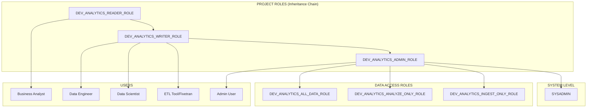
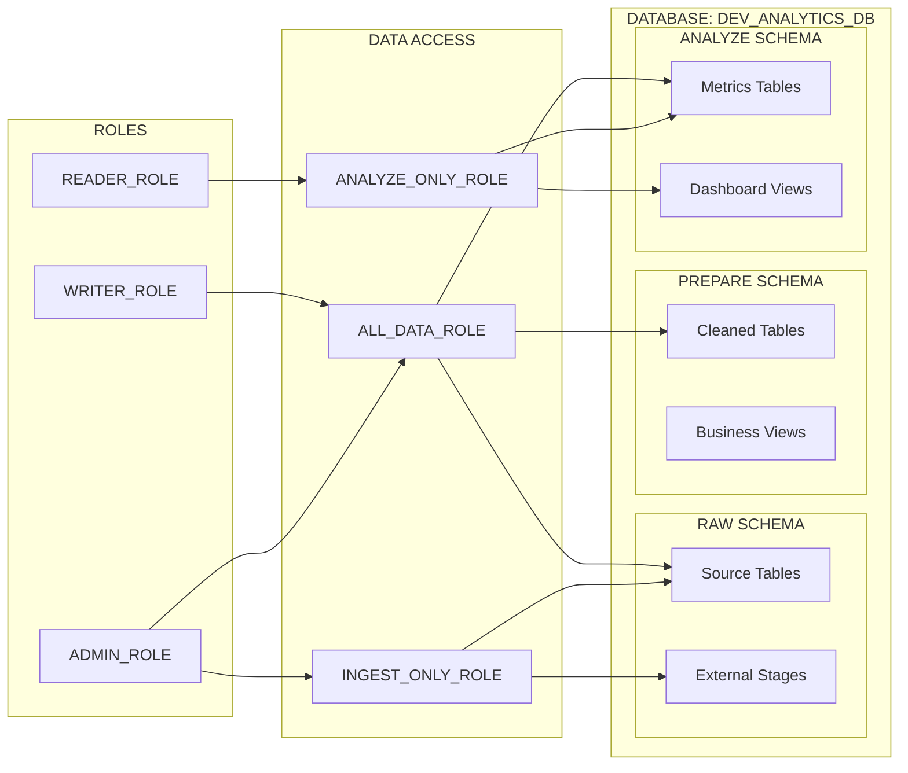

# Simplified RBAC Architecture

## Overview

A simplified, practical RBAC system with **3 functional roles** and **3 data access roles** that covers all use cases without unnecessary complexity.

## Core Role Structure

### 1. Functional Roles (What you can DO)

```hcl
resource "snowflake_account_role" "functional_roles" {
  for_each = toset([
    "READER",    # Can read data
    "WRITER",    # Can read and write data  
    "ADMIN"      # Can read, write, and administer
  ])

  name    = "${local.base_prefix}_${each.key}_ROLE"
  comment = "Functional role: ${each.key} for ${var.project_name} ${var.environment}"
}
```

### 2. Data Access Roles (What data you can access)

```hcl
resource "snowflake_account_role" "data_access_roles" {
  for_each = toset([
    "ALL_DATA",      # Access to RAW, PREPARE, ANALYZE
    "ANALYZE_ONLY",  # Access to ANALYZE layer only
    "INGEST_ONLY"    # Access to RAW layer only (for ingestion)
  ])

  name    = "${local.base_prefix}_${each.key}_ROLE"
  comment = "Data access role: ${each.key}"
}
```

## Proper Role Hierarchy: READER -> WRITER -> ADMIN -> SYSADMIN



## Role Definitions

### Functional Roles (Proper Inheritance)

| Role | Purpose | Typical Users | Permissions | Inherits From |
|------|---------|---------------|-------------|---------------|
| **SYSADMIN** | System administration | DBAs, System admins | ALL system permissions | ADMIN |
| **ADMIN** | Project administration | Platform engineers, DevOps | ALL project permissions + DDL | WRITER (which inherits READER) |
| **WRITER** | Read and write data | Data engineers, dbt developers | SELECT, INSERT, UPDATE, DELETE | READER |
| **READER** | Read-only access to data | Business analysts, Report consumers | SELECT on tables/views | - |

### Data Access Roles

| Role | Purpose | Data Access | Use Cases | Granted To |
|------|---------|-------------|-----------|------------|
| **ALL_DATA** | Access to all layers | RAW + PREPARE + ANALYZE | Data engineers, Scientists | ADMIN |
| **ANALYZE_ONLY** | Read-only analytics | ANALYZE layer only | Business users, Analysts | ADMIN |
| **INGEST_ONLY** | Data ingestion only | RAW layer only | ETL tools, Fivetran | ADMIN |

## User Role Combinations

### 1. Business Analyst
```sql
GRANT ROLE DEV_ANALYTICS_READER_ROLE TO USER analyst_jane;
```
**Result:** Can read data only

### 2. Data Engineer  
```sql
GRANT ROLE DEV_ANALYTICS_WRITER_ROLE TO USER engineer_john;
```
**Result:** Can read/write data (inherits READER permissions)

### 3. ETL Tool (Fivetran)
```sql
GRANT ROLE DEV_ANALYTICS_WRITER_ROLE TO USER fivetran_service;
```
**Result:** Can read/write data (inherits READER permissions)

### 4. Platform Admin
```sql
GRANT ROLE DEV_ANALYTICS_ADMIN_ROLE TO USER admin_sarah;
```
**Result:** Full access to everything (inherits WRITER + READER permissions + all data access roles)

## Terraform Implementation

```hcl
# Functional roles
resource "snowflake_account_role" "functional_roles" {
  for_each = toset([
    "READER",
    "WRITER", 
    "ADMIN"
  ])

  name    = "${local.base_prefix}_${each.key}_ROLE"
  comment = "Functional role: ${each.key}"
}

# Data access roles
resource "snowflake_account_role" "data_access_roles" {
  for_each = toset([
    "ALL_DATA",
    "ANALYZE_ONLY",
    "INGEST_ONLY"
  ])

  name    = "${local.base_prefix}_${each.key}_ROLE"
  comment = "Data access role: ${each.key}"
}

# Role hierarchy
resource "snowflake_grant_account_role" "functional_hierarchy" {
  for_each = snowflake_account_role.functional_roles

  role_name        = each.value.name
  parent_role_name = "SYSADMIN"
}

# Grant ADMIN role to SYSADMIN (top of hierarchy)
resource "snowflake_grant_account_role" "admin_to_sysadmin" {
  count = var.create_default_roles ? 1 : 0

  role_name        = "${local.base_prefix}_ADMIN_ROLE"
  parent_role_name = "SYSADMIN"
}

# Create proper inheritance chain: READER -> WRITER -> ADMIN
resource "snowflake_grant_account_role" "writer_inherits_reader" {
  count = var.create_default_roles ? 1 : 0

  role_name        = "${local.base_prefix}_WRITER_ROLE"
  parent_role_name = "${local.base_prefix}_READER_ROLE"
}

resource "snowflake_grant_account_role" "admin_inherits_writer" {
  count = var.create_default_roles ? 1 : 0

  role_name        = "${local.base_prefix}_ADMIN_ROLE"
  parent_role_name = "${local.base_prefix}_WRITER_ROLE"
}

# Grant data access roles to ADMIN (ADMIN gets all data access)
resource "snowflake_grant_account_role" "all_data_to_admin" {
  count = var.create_default_roles ? 1 : 0

  role_name        = "${local.base_prefix}_ALL_DATA_ROLE"
  parent_role_name = "${local.base_prefix}_ADMIN_ROLE"
}

resource "snowflake_grant_account_role" "analyze_only_to_admin" {
  count = var.create_default_roles ? 1 : 0

  role_name        = "${local.base_prefix}_ANALYZE_ONLY_ROLE"
  parent_role_name = "${local.base_prefix}_ADMIN_ROLE"
}

resource "snowflake_grant_account_role" "ingest_only_to_admin" {
  count = var.create_default_roles ? 1 : 0

  role_name        = "${local.base_prefix}_INGEST_ONLY_ROLE"
  parent_role_name = "${local.base_prefix}_ADMIN_ROLE"
}
```

## Database Permissions

### 3-Layer Data Architecture



### Permission Matrix (Proper Inheritance)

| Role | RAW Schema | PREPARE Schema | ANALYZE Schema | Inherits From |
|------|------------|----------------|----------------|---------------|
| **SYSADMIN** | ALL | ALL | ALL | ADMIN |
| **ADMIN** | ALL | ALL | ALL | WRITER (which inherits READER) |
| **WRITER** | SELECT | SELECT, INSERT, UPDATE, DELETE | SELECT, INSERT, UPDATE, DELETE | READER |
| **READER** | SELECT | SELECT | SELECT | - |

## Why This Simplification Works

### 1. **Clear Separation of Concerns**
- **Functional**: What you can do (read/write/admin)
- **Data Access**: What data you can access

### 2. **Covers All Use Cases**
- **Analysts**: READER + ANALYZE_ONLY
- **Engineers**: WRITER + ALL_DATA  
- **Scientists**: WRITER + ALL_DATA
- **ETL Tools**: WRITER + INGEST_ONLY
- **Admins**: ADMIN + ALL_DATA

### 3. **Easy to Understand**
- No confusing role names (LOADER vs INGEST)
- Clear permission levels
- Simple to assign and audit

### 4. **Flexible**
- Can combine roles for specific needs
- Easy to add new data access patterns
- Scales to multiple projects

### 5. **Proper Inheritance**
- READER is the base role
- WRITER inherits from READER (gets read permissions)
- ADMIN inherits from WRITER (gets read + write permissions)
- SYSADMIN inherits from ADMIN (gets all project permissions)
- Clear permission escalation from project to system level

## Usage Examples

### Assigning Users (Simple)
```sql
-- Business analyst (read-only)
GRANT ROLE DEV_ANALYTICS_READER_ROLE TO USER analyst_jane;

-- Data engineer (read/write)
GRANT ROLE DEV_ANALYTICS_WRITER_ROLE TO USER engineer_john;

-- Platform admin (full access)
GRANT ROLE DEV_ANALYTICS_ADMIN_ROLE TO USER admin_sarah;
```

### Checking Permissions
```sql
-- See what roles a user has
SHOW GRANTS TO USER analyst_jane;

-- See what permissions a role has
SHOW GRANTS TO ROLE DEV_ANALYTICS_READER_ROLE;
```

This simplified approach eliminates the confusion of multiple similar roles and provides a clear, scalable RBAC system. 